# 🏗️ Архитектура SOA Lab3

## Deployment диаграмма

```mermaid
graph TB
    subgraph Internet["🌐 Internet"]
        User["👤 User Browser"]
    end

    subgraph Cloudflare["☁️ Cloudflare Tunnel"]
        CFGateway["Gateway Tunnel<br/>https://xxx.trycloudflare.com<br/>→ localhost:8080"]
        CFFrontend["Frontend Tunnel<br/>https://yyy.trycloudflare.com<br/>→ localhost:3000"]
    end

    subgraph Frontend["💻 Frontend Layer"]
        React["React App<br/>Port 3000<br/>(npm start)"]
    end

    subgraph APIGateway["🚪 API Gateway Layer"]
        Zuul["Zuul Gateway<br/>Port 8080 HTTPS<br/>• SSL Termination<br/>• Routing<br/>• Load Balancing via Ribbon"]
    end

    subgraph ServiceDiscovery["🔍 Service Discovery"]
        Eureka["Eureka Server<br/>Port 8761<br/>• Registers all services<br/>• Health monitoring"]
        Consul["Consul<br/>Port 8500<br/>• Service1 registration<br/>• Health checks"]
    end

    subgraph ConfigManagement["⚙️ Configuration"]
        ConfigServer["Config Server<br/>Port 8888<br/>• Centralized config<br/>• Git-based"]
    end

    subgraph Service2["🦸 Service2 - Heroes (Spring Cloud)"]
        S2I1["Heroes Instance 1<br/>Port 8091<br/>Spring Boot + JPA"]
        S2I2["Heroes Instance 2<br/>Port 8092<br/>Spring Boot + JPA"]
    end

    subgraph Service1Proxy["🔄 Service1 Proxy Layer"]
        S1EC1["Eureka Client 1<br/>Port 8089<br/>Spring Boot Proxy<br/>WILDFLY_URL=:8082"]
        S1EC2["Eureka Client 2<br/>Port 8090<br/>Spring Boot Proxy<br/>WILDFLY_URL=:8083"]
    end

    subgraph Service1["👥 Service1 - Human Beings (Jakarta EE)"]
        S1I1["WildFly Instance 1<br/>Port 8082<br/>• JAX-RS<br/>• EJB Pool<br/>• JPA/Hibernate"]
        S1I2["WildFly Instance 2<br/>Port 8083<br/>• JAX-RS<br/>• EJB Pool<br/>• JPA/Hibernate"]
    end

    subgraph Database["💾 Database Layer"]
        PostgreSQL["PostgreSQL<br/>Port 5432<br/>Database: soa_lab3"]
    end

    %% User connections
    User -->|HTTPS| CFFrontend
    User -->|HTTPS API Calls| CFGateway

    %% Cloudflare to services
    CFFrontend -->|HTTP| React
    CFGateway -->|HTTPS| Zuul

    %% Frontend to Gateway
    React -->|REST API| Zuul

    %% Service Discovery registration
    Zuul -.->|Register & Heartbeat| Eureka
    S2I1 -.->|Register & Heartbeat| Eureka
    S2I2 -.->|Register & Heartbeat| Eureka
    S1EC1 -.->|Register & Heartbeat| Eureka
    S1EC2 -.->|Register & Heartbeat| Eureka
    S1I1 -.->|Register & Health Check| Consul
    S1I2 -.->|Register & Health Check| Consul

    %% Config Server
    S2I1 -.->|Fetch Config| ConfigServer
    S2I2 -.->|Fetch Config| ConfigServer

    %% Zuul routing with Ribbon
    Zuul -->|Query instances| Eureka
    Zuul -->|Round Robin<br/>/api/heroes/**| S2I1
    Zuul -->|Round Robin<br/>/api/heroes/**| S2I2
    Zuul -->|Round Robin<br/>/api/human-beings/**| S1EC1
    Zuul -->|Round Robin<br/>/api/human-beings/**| S1EC2

    %% Proxy to WildFly
    S1EC1 -->|Proxy all requests| S1I1
    S1EC2 -->|Proxy all requests| S1I2

    %% Database connections
    S2I1 -->|JPA/Hibernate| PostgreSQL
    S2I2 -->|JPA/Hibernate| PostgreSQL
    S1I1 -->|JPA/Hibernate<br/>via EJB| PostgreSQL
    S1I2 -->|JPA/Hibernate<br/>via EJB| PostgreSQL

    %% Styling
    classDef frontend fill:#61dafb,stroke:#333,stroke-width:2px,color:#000
    classDef gateway fill:#00d084,stroke:#333,stroke-width:2px,color:#000
    classDef discovery fill:#ffd700,stroke:#333,stroke-width:2px,color:#000
    classDef service1 fill:#ff6b6b,stroke:#333,stroke-width:2px,color:#fff
    classDef service2 fill:#4ecdc4,stroke:#333,stroke-width:2px,color:#000
    classDef proxy fill:#95e1d3,stroke:#333,stroke-width:2px,color:#000
    classDef database fill:#a8e6cf,stroke:#333,stroke-width:2px,color:#000
    classDef config fill:#ffb6c1,stroke:#333,stroke-width:2px,color:#000
    classDef cloud fill:#87ceeb,stroke:#333,stroke-width:2px,color:#000

    class React frontend
    class Zuul gateway
    class Eureka,Consul discovery
    class S1I1,S1I2 service1
    class S2I1,S2I2 service2
    class S1EC1,S1EC2 proxy
    class PostgreSQL database
    class ConfigServer config
    class CFGateway,CFFrontend cloud
```



---

## Request Flow диаграмма

### Flow 1: GET /api/heroes

```mermaid
sequenceDiagram
    participant U as 👤 User
    participant CF as ☁️ Cloudflare
    participant Z as 🚪 Zuul Gateway
    participant E as 🔍 Eureka
    participant R as ⚖️ Ribbon
    participant S2 as 🦸 Service2<br/>(Instance 1)
    participant DB as 💾 PostgreSQL

    U->>CF: GET https://xxx.trycloudflare.com/api/heroes
    CF->>Z: GET https://localhost:8080/api/heroes
    Z->>E: Query: Where is heroes-service?
    E-->>Z: Instances: 8091, 8092
    Z->>R: Select instance (Round Robin)
    R-->>Z: Selected: localhost:8091
    Z->>S2: GET http://localhost:8091/heroes
    S2->>DB: SELECT * FROM human_beings...
    DB-->>S2: ResultSet
    S2-->>Z: JSON Response
    Z-->>CF: JSON Response
    CF-->>U: JSON Response
```



### Flow 2: GET /api/human-beings/statistics/mood-count/1

```mermaid
sequenceDiagram
    participant U as 👤 User
    participant CF as ☁️ Cloudflare
    participant Z as 🚪 Zuul Gateway
    participant E as 🔍 Eureka
    participant R as ⚖️ Ribbon
    participant EC as 🔄 Eureka Client<br/>(Proxy)
    participant W as 👥 WildFly<br/>Instance 1
    participant EJB as 📦 EJB Pool
    participant DB as 💾 PostgreSQL

    U->>CF: GET /api/human-beings/statistics/mood-count/1
    CF->>Z: HTTPS Request
    Z->>E: Query: Where is human-beings-service?
    E-->>Z: Instances: 8089, 8090 (Eureka Clients!)
    Z->>R: Select instance (Round Robin)
    R-->>Z: Selected: localhost:8089
    Z->>EC: GET http://localhost:8089/api/human-beings/statistics/mood-count/1
    Note over EC: ProxyController intercepts<br/>WILDFLY_URL=http://localhost:8082/service1-web
    EC->>W: GET http://localhost:8082/service1-web/api/human-beings/statistics/mood-count/1
    Note over W: JAX-RS routes to<br/>@Path("/human-beings")<br/>@Path("/statistics/mood-count/{moodValue}")
    W->>EJB: JNDI lookup + method call
    Note over EJB: Stateless EJB from pool
    EJB->>DB: JPA Query:<br/>COUNT WHERE mood = 'SORROW'
    DB-->>EJB: count = 5
    EJB-->>W: return count
    W-->>EC: {"count":5,"mood":"SORROW"}
    EC-->>Z: {"count":5,"mood":"SORROW"}
    Z-->>CF: JSON Response
    CF-->>U: JSON Response
```



---

## Component диаграмма


---

## Technology Stack


---

## Ports Overview

| Component | Port(s) | Protocol | Description |
|-----------|---------|----------|-------------|
| **Frontend** | 3000 | HTTP | React Dev Server |
| **Zuul Gateway** | 8080 | HTTPS | API Gateway (SSL) |
| **Eureka Server** | 8761 | HTTP | Service Registry |
| **Consul** | 8500 | HTTP | Service Discovery + Health |
| **Config Server** | 8888 | HTTP | Configuration Management |
| **Service1 WildFly #1** | 8082 | HTTP | Jakarta EE Application |
| **Service1 WildFly #2** | 8083 | HTTP | Jakarta EE Application |
| **Service1 Eureka Client #1** | 8089 | HTTP | Proxy to WildFly #1 |
| **Service1 Eureka Client #2** | 8090 | HTTP | Proxy to WildFly #2 |
| **Service2 Instance #1** | 8091 | HTTP | Spring Boot Application |
| **Service2 Instance #2** | 8092 | HTTP | Spring Boot Application |
| **PostgreSQL** | 5432 | TCP | Database |

---

## Load Balancing Strategy


**Algorithm**: Round Robin (по умолчанию в Ribbon)
- Request 1 → Instance 1
- Request 2 → Instance 2
- Request 3 → Instance 1
- Request 4 → Instance 2
- ...

---

## Health Check Flow

```mermaid
graph LR
    subgraph "Service1 Health"
        S1[WildFly] -->|HTTP GET| HC1[/service1-web/api/health]
        HC1 -->|10s interval| Consul
    end
    
    subgraph "Service2 Health"
        S2[Spring Boot] -->|Built-in| HC2[/actuator/health]
        HC2 -->|30s heartbeat| Eureka
    end
    
    subgraph "Proxy Health"
        EC[Eureka Client] -->|Built-in| HC3[/actuator/health]
        HC3 -->|30s heartbeat| Eureka
    end
```

---

## Scaling Commands

```bash
# View current status
./scale.sh status

# Scale Service1 to 5 instances
./scale.sh service1 5

# Scale Service2 to 3 instances
./scale.sh service2 3

# Scale both
./scale.sh all 4 6

# Load test
./load-test.sh https://localhost:8080 100
```
